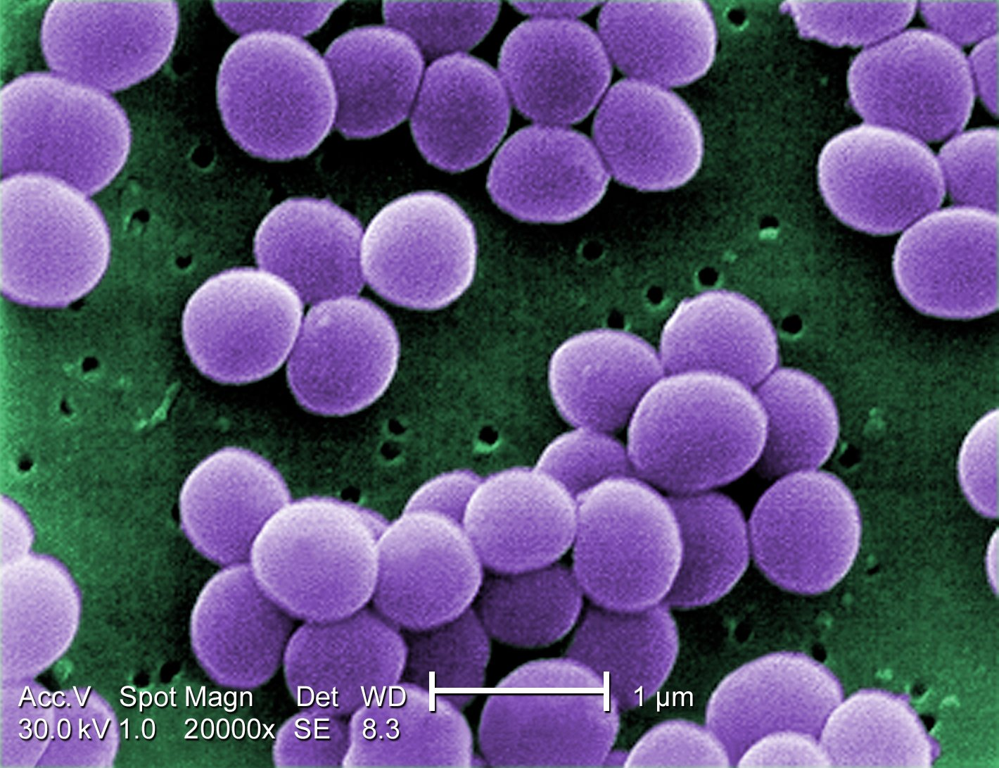

### Biotechnology and Industry
+ Microbes
    + minute living things that are too small to be seen by the naked eye.
    + examples: bacteria, fungi, protozoa, microalgae, viruses.
    

+ Microbal Biotechnology
    + application of scientific and engineering principles